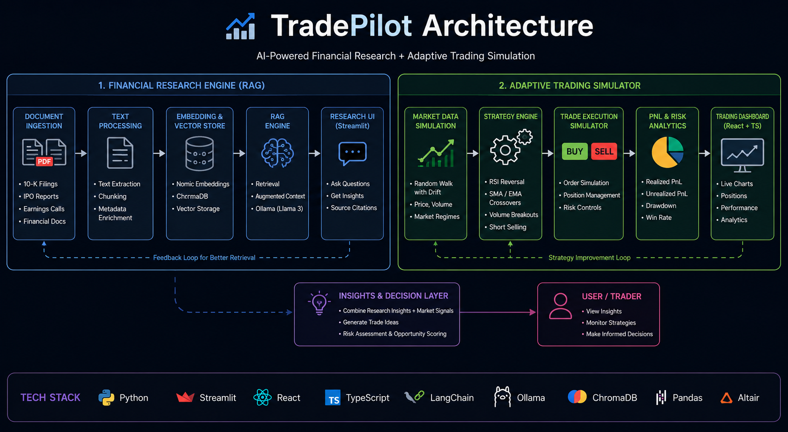

# 📈 TradePilot — Autonomous Trading Research Engine


---
## 🏗️ Architecture


---


## 🧠 Overview

TradePilot is a full-stack financial intelligence platform that combines AI-powered financial research with adaptive trading strategy simulation.

The platform is designed to analyze complex financial documents, extract market insights using Retrieval-Augmented Generation (RAG), and support autonomous trading research workflows through interactive dashboards and strategy simulations.

---

## 🚀 Core Modules

### 📄 Financial Research Engine

A privacy-focused RAG pipeline that processes:

* SEC 10-K filings
* IPO prospectuses
* Earnings transcripts
* Financial reports

The engine performs semantic search and evidence-based question answering using local LLM inference through Ollama.

#### Features

* Fully local AI inference using Ollama (Llama 3)
* Retrieval-Augmented Generation (RAG)
* Semantic search with ChromaDB
* Context-aware document chunking
* Source-cited financial analysis
* Conversational research interface

---

### 🤖 Adaptive Trading Simulator

An interactive trading simulation dashboard that visualizes algorithmic trading strategies on dynamically generated market data.

The simulator includes a separate React + TypeScript frontend for monitoring strategies, charting market behavior, and tracking trading performance in real time.

#### Features

* Realistic market simulation using Random Walk with Drift
* RSI reversal strategy
* SMA & EMA crossover strategies
* Volume breakout detection
* Real-time realized/unrealized PnL tracking
* Interactive trading visualizations
* Short-selling support
* React + TypeScript frontend dashboard

---


## 🛠️ Tech Stack

### Backend & AI

* Python
* LangChain
* Ollama (Llama 3)
* ChromaDB
* Nomic Embeddings

### Frontend

* React
* TypeScript
* HTML
* CSS

### Visualization & Analytics

* Streamlit
* Pandas
* NumPy

---

## ⚙️ Installation

### Clone Repository

```bash
git clone https://github.com/adarsh0052/TradePilot.git
cd TradePilot
```

---

### Create Virtual Environment

```bash
python -m venv venv
```

#### Windows

```bash
venv\Scripts\activate
```

#### Mac/Linux

```bash
source venv/bin/activate
```

---

### Install Dependencies

```bash
pip install -r requirements.txt
```

---

### Install Ollama Models

```bash
ollama pull llama3
ollama pull nomic-embed-text
```

---

## ▶️ Running the Application

```bash
streamlit run main.py
```


